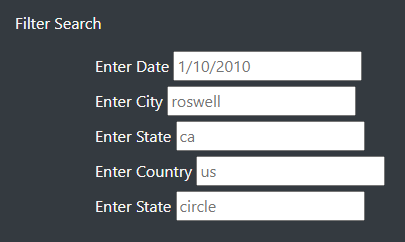
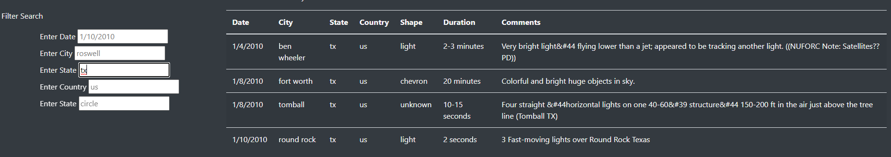

# UFO

## Overview of the Analysis

The purpose of this assignment was to refactor the module javascript code to incorporate more filters of the UFO sighting data provided. 

## Results

The module code focused on one filter (date) and was set to filter on clicking a button. This assignment required us to incorportate more filters and driving the filter based on any change events 

The first was the addition of the filter buttons.  As shown below, the webpage now allows for filters for the following parameters: 

This was acheived by adding in a unordered list within our container fluid. Each filter was given a label corresponding with the id as well as a placeholder text. All were labeled as input types.  

       

              

                

                  <form class="bg-dark">
                    
Filter Search

                    <ul class="bg-dark">
                      <ul class="bg-dark">
                        <label for="date">Enter Date</label>
                        <input type="text" placeholder="1/10/2010" id="datetime" />
                      </ul>
                      <ul class="bg-dark">
                          <label for="city">Enter City</label>
                          <input type="text" placeholder="roswell" id="city" />
                      </ul>
                      <ul class="bg-dark">
                          <label for="state">Enter State</label>
                          <input type="text" placeholder="ca" id="state" />
                      </ul>
                      <ul class="bg-dark">
                          <label for="country">Enter Country</label>
                          <input type="text" placeholder="us" id="country" />
                      </ul>
                      <ul class="bg-dark">
                          <label for="shape">Enter State</label>
                          <input type="text" placeholder="circle" id="shape" />
                      </ul>
                    </ul>
                   </form>
                

The first change that was made to our script was the change of how the event would be handled. Previously, we had a button that would be the notification for change, but on this exercise we wanted any change to signify we want the script to be ran. This was done by using a d3.selectAll function that was linked to our inpout tags based on any change and our updateFilters function. 

        d3.selectAll("input").on("change",updateFilters);

From there we finished the creation of our two functions: updateFilters and FilterTable. 

Function updateFilters function primarily was used to keep track of all the filters applied. We are able to do that by saving all parameters to a variable created called filter. This is shown in code below: 
           
        var filters = {};

        function updateFilters() {

            let changedElement = d3.select(this);

            let elementValue =changedElement.property("value");

            let filterId = changedElement.attr("id");

            if (elementValue) {
              filters[filterId] = elementValue;
            }

            else {
              delete filters[filterId];
            }

           filterTable();
  
       }

The second function filterTable was created to actually filter the table once the filters were saved. I created different variables to hold the data for each item. Using arrow functions, we were able to filter through each parameter. Finally, the table was built using the filtered table. 

        function filterTable() {

              let date = d3.select("#datetime").property("value");
              let city = d3.select("#city").property("value");
              let state = d3.select("#state").property("value");
              let shape = d3.select("#shape").property("value");
              let country = d3.select("#country").property("value");

              let filteredData = tableData;  

              if (date) {
                filteredData = filteredData.filter(row => row.datetime === date);
              }

              if (city) {
                filteredData = filteredData.filter(row => row.city === city);
              }

              if (country) {
                filteredData = filteredData.filter(row => row.country === country);
              }

               if (state) {
                filteredData = filteredData.filter(row => row.state === state);
              }

              if (shape) {
                filteredData = filteredData.filter(row => row.shape === shape);
              }

              buildTable(filteredData);
        }

Combining both of these functions, we can filter by each parameter. One example is shown below as state is filtered by "tx".

## Summary 

One drawpack of this webpage is that the table in its unfiltered format is not contained in a certain size, so it is essentially a long webpage. It only becomes reasonable when filtered. If you had any additional items below the table, you would have to scroll past all the data to get to it. 

To develop this further, I would insert the table in a sized container with its own scroll bar. This will help contain the data in a more readable format. In addition, I would also add export functionality so that anyone looking at the data could export and save as needed. These two enhancements would make it easier for the user to look at the data. 
